[![Contributors][contributors-shield]][contributors-url]
[![Forks][forks-shield]][forks-url]
[![Stargazers][stars-shield]][stars-url]
[![Issues][issues-shield]][issues-url]
[![GNU GPLv3 License][license-shield]][license-url]

<!-- PROJECT TITLE -->
<!--suppress HtmlDeprecatedAttribute, HtmlUnknownAnchorTarget -->

<h3 align="center">Study Hub</h3>
  

    This is the main codebase of StudyHub. The backend server is implemented in Python Flask.
     
    <a href="https://github.com/TheTrustyPwo/StudyHub/issues">Report Bug</a>
    ·
    <a href="https://github.com/TheTrustyPwo/StudyHub/issues">Request Feature</a>
  

<!-- TABLE OF CONTENTS -->

  
Table of Contents

  <ol>
    <li><a href="#about-the-project">About The Project</a></li>
    <li><a href="#license">License</a></li>
    <li><a href="#contact">Contact</a></li>
  </ol>

<!-- ABOUT THE PROJECT -->

## About The Project

### 1. Introduction

#### 1.1. Issue

In today's digital era, education has seen new possibilities, but finding practical, user-friendly learning platforms is
still a challenge. Many students find it hard to connect with peers for academic help, guidance, and collaboration due
to various reasons like lack of confidence or convenience. This creates a gap in seeking support for their studies.

#### 1.2. Rationale

The "StudyHub" concept emerged to create a comprehensive academic platform. Our aim is to facilitate student
collaboration, accelerate learning, and offer a space for meaningful academic discussions. By combining AI tools with a
social media approach, we streamline academic consultations and encourage connections among like-minded students.

#### 1.3. Focus and Significance

Surprisingly, there is a lack of social media platforms dedicated solely to academics. Most academic-oriented platforms
lack user-to-user interaction and a clear framework for consultation. Hence, our significance lies in providing students
with a space to collaborate, accelerate learning, and engage in meaningful academic discussions, thereby fostering a
dynamic learning environment. This initiative addresses the need for accessible and effective academic consultation
while promoting connections among students with shared academic goals.

#### 1.4. Scope

Our target audience currently is students between the ages of 12 and 16 due to the limited time frame of the project and
we hope to expand our reach to students of all ages in the future. However, we will be test-running our product within
the confines of our school.

### 2. Market Research

#### 2.1. Duolingo

Duolingo is a language-learning app that uses AI to personalize the learning experience for each student, with
gamification to make learning fun and engaging. However, like most other learning platforms, it lacks user-to-user
interaction, and this is something StudyHub aims to improve on by implementing discussion forums and direct messaging.

#### 2.2. Brainly

Brainly is a social learning platform with a community of over 350 million students and educators. The platform allows
students to ask and answer questions, earn points for answering questions, and participate in discussions. Similarly,
StudyHub aims to connect students and encourage them to participate in academic discussions. The main difference is that
StudyHub provides tools powered by Artificial Intelligence to enhance and streamline students’ learning.

### 3. Study and Methodology

#### 3.1. Ideation

During our brainstorming sessions, we settled on a social media platform. Eventually, after further research and needed
analysis, we decided on a platform which emphasizes on academic growth and discussion, while also leveraging on
Artificial Intelligence to provide students with the tools to study more efficiently. This forged the bedrock for
StudyHub.

#### 3.2. Description of Study

We have conducted market research as well as sufficient needs analysis which collects the perspectives of our target
audience, students. We have also delved deeper into students’ usage of social media, as well as their fear of seeking
academic consultation.

A 2018 Pew Research Center survey of nearly 750 13 to 17-year-olds found that 45% are online on social media almost
constantly and 97% use a social media platform.

Additionally, according to scientificamerican.com, new research suggests that young children don't seek help in school,
even when they need it, as they view it as a form of broadcasting their incompetence.

We have decided to capitalize on students’ inclination to use social media platforms, as well as their need for a
platform to reach out for academic support.

#### 3.3. Needs Analysis

The following are some survey results from our student respondents:

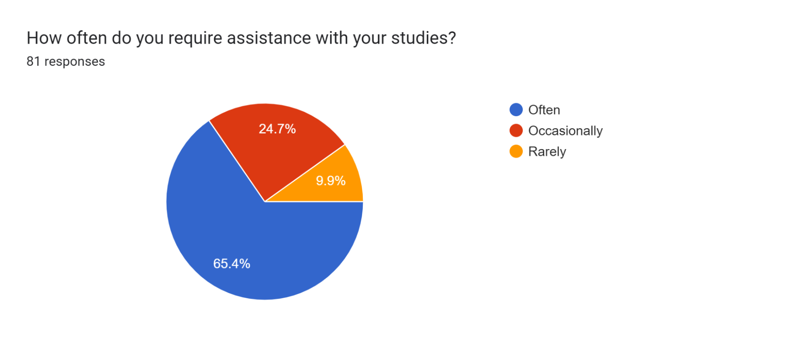
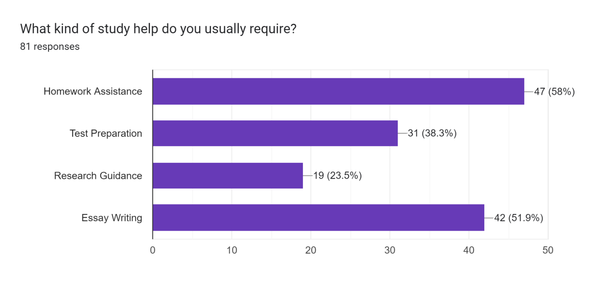
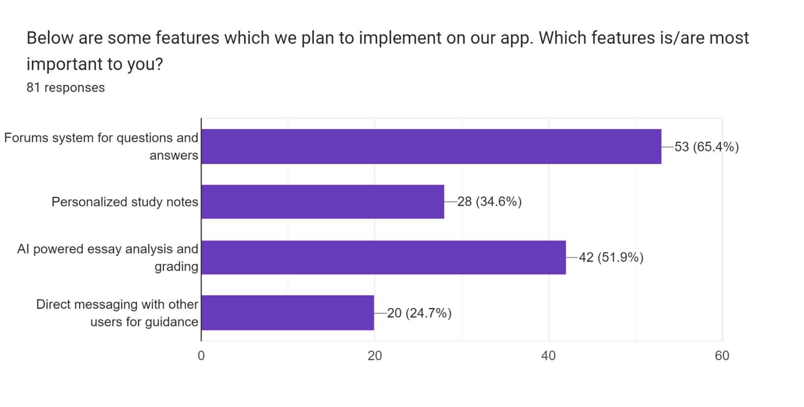

### 4. Outcomes, Analysis, and Discussion

#### 4.1. Final Product

Our final product crystallized into a website-run social media platform, Study Hub. We also have an Instagram page from
which users can get updates on the latest features of StudyHub.

#### 4.2. Framework

The following is the framework for our SQL database:

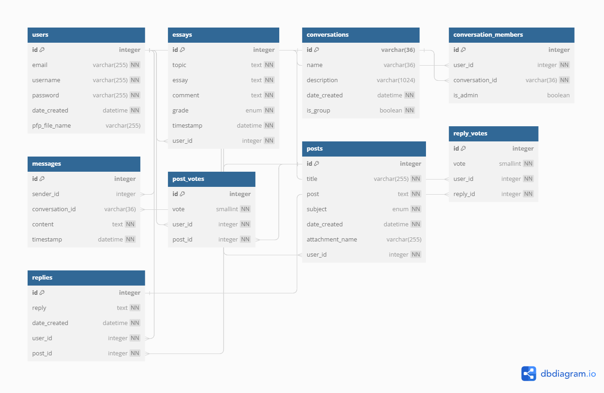

Our frontend is mainly driven by HTML, CSS and Javascript, while our backend will be mostly run by Python, specifically
Flask, which is a micro web framework written in Python.

#### 4.3 Instagram page

We used Instagram to publicise and promote our website to students.

#### 4.4 Artificial Intelligence

Artificial Intelligence powers 2 features of our application as shown below.

##### 4.4.1 Automated essay grading and feedback

Prompt engineering was employed to fine-tune the essay grading prompt, utilizing techniques such as Role and Scenario
Setting, Instruction Breakdown, and Specific Guidelines and Expectations. These methods collectively optimized the
grading process, ensuring precision and clarity.

The prompt includes a rubric and well-defined evaluation criteria aligned with educational grading standards. This
ensures a comprehensive approach, evaluating linguistic proficiency, content relevance, and essay structure. In
contrast, a generic "grade my essay" request lacks the depth of StudyHub's tailored prompts.

The StudyHub app streamlines essay grading, allowing easy essay submission, prompt evaluations, and focused feedback.
This enhances user engagement and productivity, providing efficient analysis without lengthy interactions. The app
offers distinct advantages, delivering insightful analysis and bypassing complexities.

##### 4.4.2 Explaining concepts which align with exam requirements

GPT models provide general knowledge-based responses, which may not consistently align with specific examination
criteria like those of O level exams due to distinct formatting and guidelines. Although using the entire textbook for
every AI query is theoretically possible, it is financially impractical.

Instead, a more efficient approach employing text embeddings is employed. The data is divided into smaller segments of
around 200 for manageable processing. OpenAI’s text-embedding-ada-002 model is utilized to transform these segments into
numerical vectors, capturing semantic nuances and contextual structure. These vectors are stored in a specialized vector
database like Pinecone, enabling swift and efficient searches.

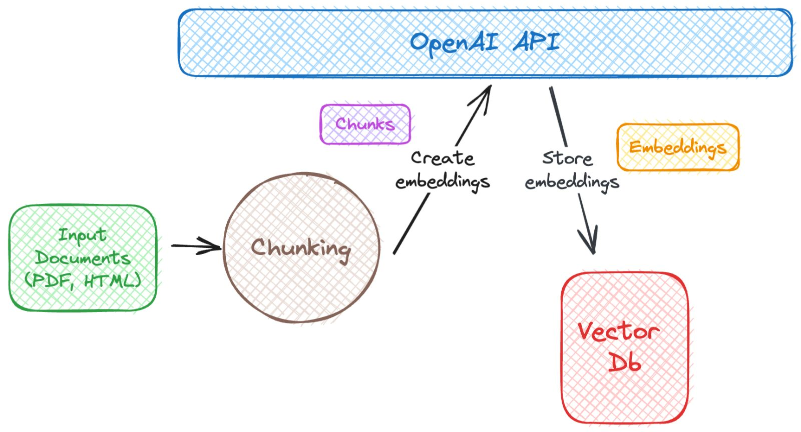

Upon receiving a user question, the question is first transformed into a text embedding using OpenAI’s ADA model. A
query is then sent to the Pinecone vector database, retrieving the top k (in our instance, 5) vectors related to the
query's embedding. These vectors correspond to relevant text sections.

For a comprehensive response, these selected text segments, along with the original question, are input into the GPT-3.5
model, which uses these texts to generate a contextualized answer that aligns with the question and reference texts.
This process ensures that the answers provided are contextually pertinent and backed by information within the
recognized text segments.

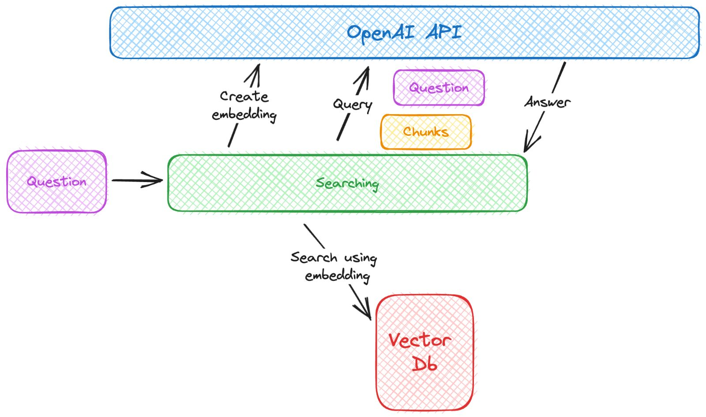

#### 4.5. Code

The programming languages utilized were Python, HTML, CSS, and JavaScript.

#### 4.6. Snapshots

Below are screenshots of different pages on our website.

**User Page**
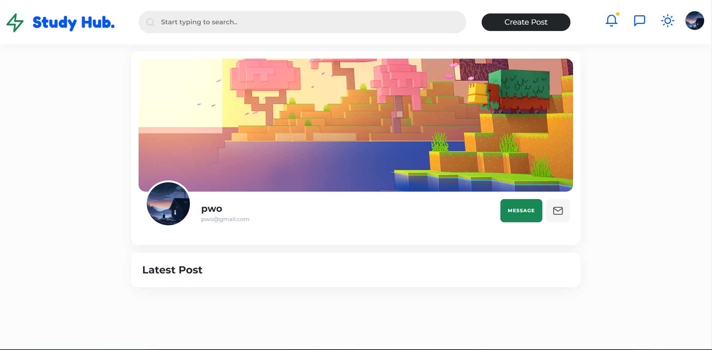

**Home Page** (Dark Theme)
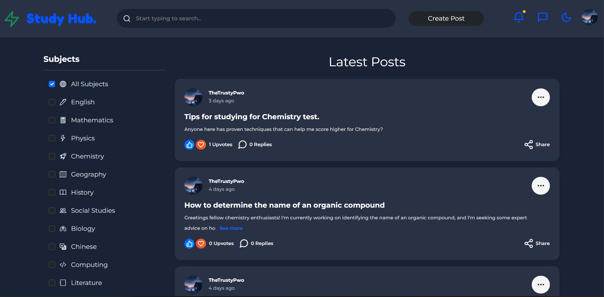

**Post Page** (Dark Theme)
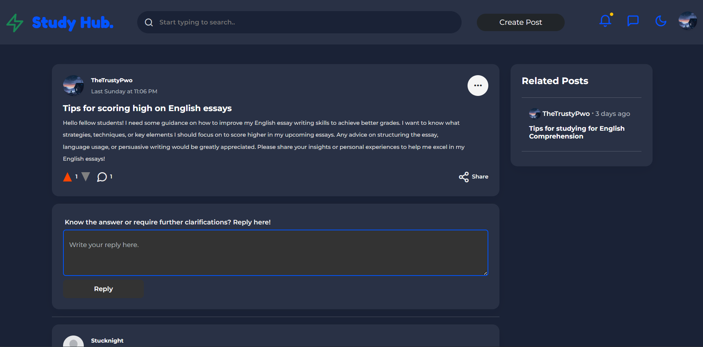

**Essay Grading Page**
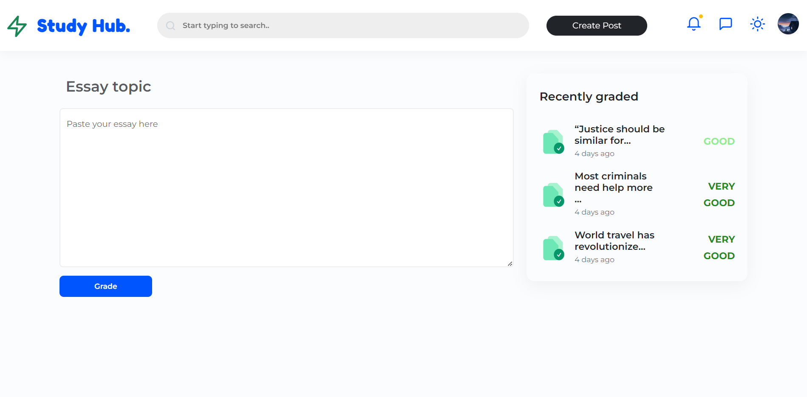

**Essay Results Page**
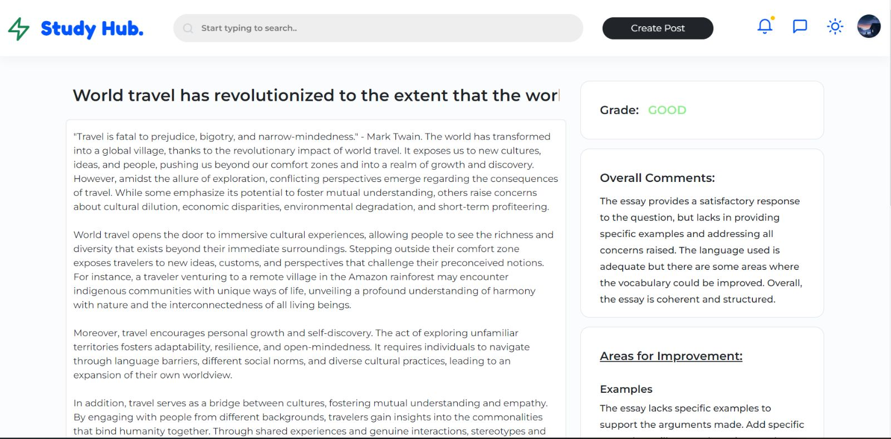

**AI Q&A page**
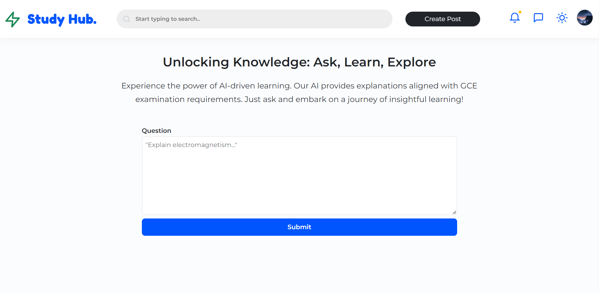

### 5. User Feedback

This shows StudyHub has accomplished its goal of assisting students in their learning.

This suggests that StudyHub does cater to the needs of the students. Suggestions:

We have improved the website based on these suggestions.

### 6. Implications and Recommendations

Even though StudyHub has proven to be a comprehensive learning platform which caters to the needs of the students, there
are still many areas it can improve upon.

The website is only suitable to be viewed on large screens such as tablets or laptops and we hope to create a more
mobile friendly UI, and possibly a mobile app in the future. We could consider switching to a more powerful AI, GPT-4 to
provide more reliable and accurate answers. Furthermore, more AI tools can be implemented such as personalized study
notes and mock tests with questions generated by AI.

It goes without saying that we will continue to improve StudyHub even after this project work, as we strive to unlock
its fullest potential as an invaluable academic companion.

(<a href="#top">back to top</a>)

<!-- LICENSE -->

## License

Distributed under the GNU GPLv3 License. See `LICENSE.txt` for more information.

(<a href="#top">back to top</a>)

<!-- CONTACT -->

## Contact

TheTrustyPwo - Pwo#0001 - thetrustypwo@gmail.com

Project Link: [https://github.com/TheTrustyPwo/StudyHub](https://github.com/TheTrustyPwo/StudyHub)

(<a href="#top">back to top</a>)

<!-- MARKDOWN LINKS & IMAGES -->

[contributors-shield]: https://img.shields.io/github/contributors/TheTrustyPwo/StudyHub.svg?style=for-the-badge

[contributors-url]: https://github.com/TheTrustyPwo/StudyHub/graphs/contributors

[forks-shield]: https://img.shields.io/github/forks/TheTrustyPwo/StudyHub.svg?style=for-the-badge

[forks-url]: https://github.com/TheTrustyPwo/StudyHub/network/members

[stars-shield]: https://img.shields.io/github/stars/TheTrustyPwo/StudyHub.svg?style=for-the-badge

[stars-url]: https://github.com/TheTrustyPwo/StudyHub/stargazers

[issues-shield]: https://img.shields.io/github/issues/TheTrustyPwo/StudyHub.svg?style=for-the-badge

[issues-url]: https://github.com/TheTrustyPwo/StudyHub/issues

[license-shield]: https://img.shields.io/github/license/TheTrustyPwo/StudyHub.svg?style=for-the-badge

[license-url]: https://github.com/TheTrustyPwo/StudyHub/blob/master/LICENSE.txt